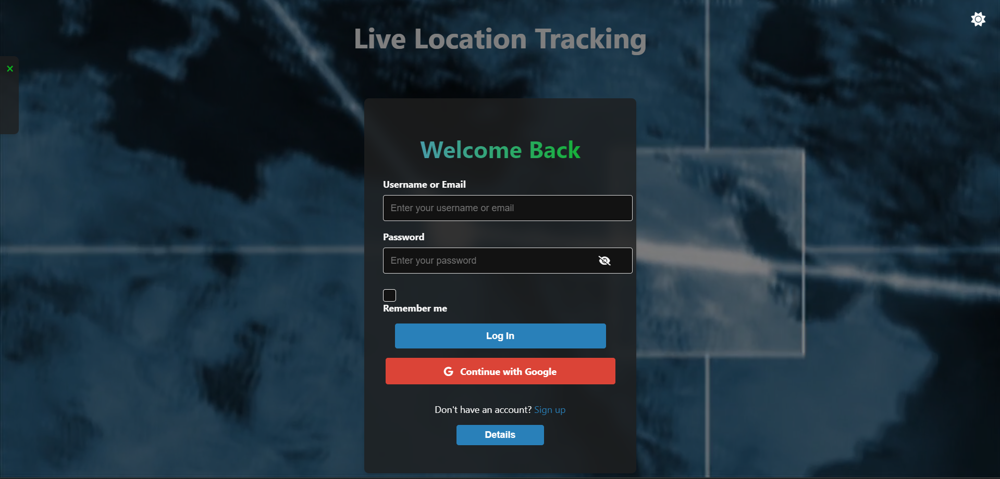
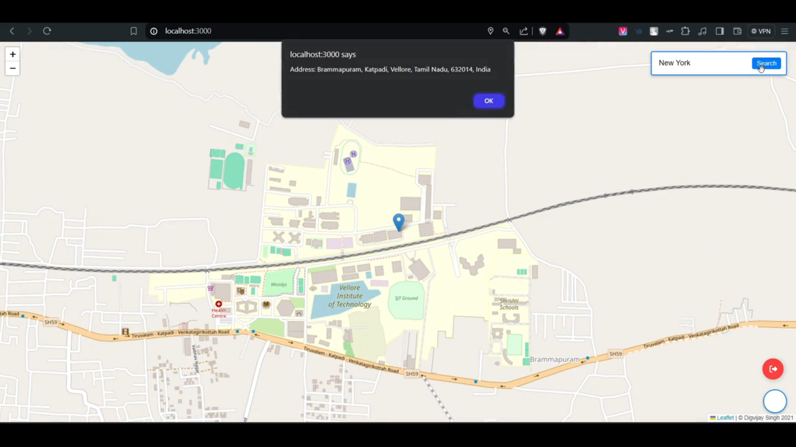

# Live Tracking Project


This is a live tracking web application that allows users to track real-time locations on a map. The application utilizes Leaflet for map rendering and supports **Google OAuth** for user authentication.

## What is Live Tracking?

Live Tracking is a web application designed to provide real-time location tracking. It is ideal for use cases such as tracking delivery vehicles, monitoring the whereabouts of individuals, and managing fleets. The application leverages the power of maps to present dynamic, real-time data in an interactive and user-friendly manner.

## Problems It Solves

- **Real-time Location Updates:** Provides up-to-the-minute location data for assets or individuals.
- **User Authentication:** Ensures secure access through Google OAuth, protecting user data.
- **Interactive Mapping:** Utilizes Leaflet to deliver an intuitive map interface for easy navigation and tracking.
- **Scalability:** Supports multiple users and tracks various entities simultaneously without performance degradation.

## Features

- Real-time location tracking
- User authentication via Google OAuth
- Interactive map with Leaflet
- Secure JWT-based authentication

## Technologies Used

- **Frontend:** EJS, HTML, CSS, JavaScript
- **Backend:** Node.js, Express.js
- **Authentication:** Passport.js, Google OAuth 2.0
- **Map Rendering:** Leaflet
- **WebSockets:** Socket.io
- **Session Management:** express-session
- **Environment Variables:** dotenv

## Installation

1. **Clone the repository:**

    ```sh
    git clone https://github.com/Digvijay2347/Live-Tracking.git
    cd Live-Tracking
    ```

2. **Install dependencies:**

    ```sh
    npm install
    ```

3. **Set up environment variables:**

    Create a `.env` file in the root of the project and add your Google OAuth credentials and JWT secret key:

    ```env
    GOOGLE_CLIENT_ID=your-google-client-id
    GOOGLE_CLIENT_SECRET=your-google-client-secret
    JWT_SECRET_KEY=your-jwt-secret-key
    ```

4. **Start the application:**

    For development:

    ```sh
    npm run dev
    ```

    For production:

    ```sh
    npm start
    ```

## Usage

1. **Open your browser and navigate to:**

    ```sh
    http://localhost:3000
    ```

2. **Sign up or log in using Google OAuth.**

3. **Start tracking live locations on the map.**



## Video Demo
Check out the video demo of the Live Tracking app:
<video src="https://github.com/user-attachments/assets/b3685cce-8766-4766-92ad-42931feab991" loop muted autoplay>
  Your browser does not support the video tag.
</video>


## Contributing

1. **Fork the repository:**

    ```sh
    git fork https://github.com/Digvijay2347/Live-Tracking.git
    ```

2. **Create your feature branch:**

    ```sh
    git checkout -b feature/new-feature
    ```

3. **Commit your changes:**

    ```sh
    git commit -m 'Add some feature'
    ```

4. **Push to the branch:**

    ```sh
    git push origin feature/new-feature
    ```

5. **Open a pull request.**

## Subscribe for Updates

Stay updated with the latest features and improvements.


## License

This project is licensed under the MIT License.

## Acknowledgments

- [Leaflet](https://leafletjs.com/) for the map rendering library
- [Passport.js](http://www.passportjs.org/) for authentication
- [Socket.io](https://socket.io/) for real-time communication

---

## Badges

[](https://github.com/Digvijay2347/Live-Tracking/actions)
[](LICENSE)
[](https://github.com/Digvijay2347/Live-Tracking/releases)

Happy tracking! 🚀
